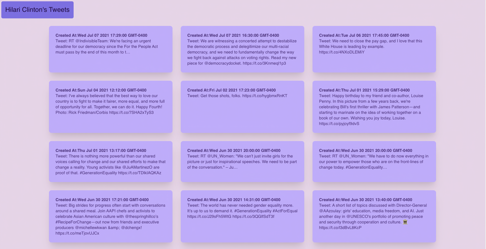
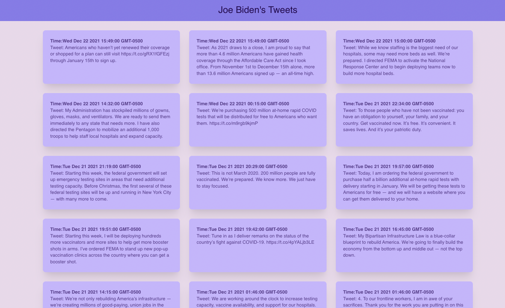
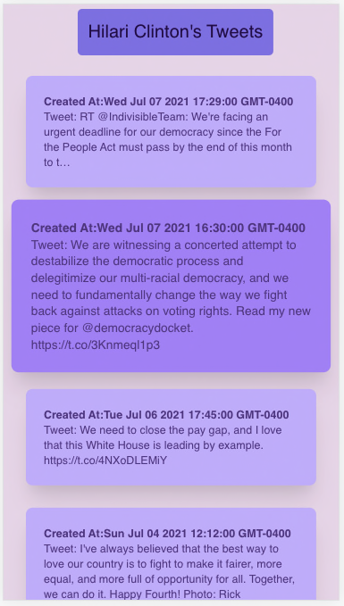

# joehilari-tweets

The joehilari-tweets API has been created for education purpose. It is pulling Joe Biden and Hilari Clinton's timeline tweets.

Open http://localhost:3000 to view it in the browser.
Server runs on http://localhost:8000

### API DOcs

https://github.com/aruchowdhury/joehilari-tweets/blob/branch-1/back/API_DOCS.md

### Technologies used

React, Styled-components, Node, Express, TailwindCSS, Moment.

### Demo video:

### Features

This is a mobile responsive web-based application where anyone can check latest 20 tweets from Joe Biden and Hilari Clinton.
To switch the view from Hilari clinton to Joe Biden user have to click on the navigation icon at the top right corner.

