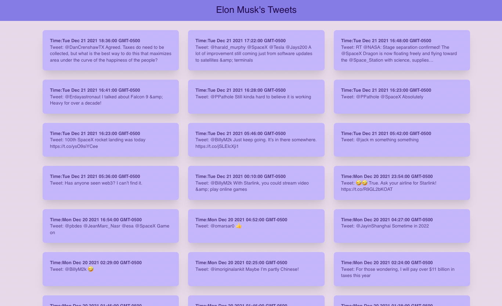
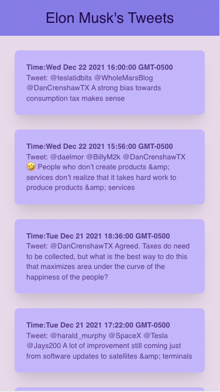

# twitterAPI

The twitterAPI has been created for education purpose. It is pulling Joe Biden and Elon musk's timeline tweets.

Open http://localhost:3000 to view it in the browser.
Server runs on http://localhost:8000

### API DOcs

https://github.com/aruchowdhury/twitterAPI/blob/main/back/API_DOCS.md

### Technologies used

React, Styled-components, Node, Express, TailwindCSS, Moment and React-card-flip.

### Demo video:

### Features

This is a mobile responsive web-based application where anyone can check latest 30 tweets from Joe Biden and Elon Musk.
To switch the view from Elon Musk to Joe Biden user have to click on the navigation icon at the top right corner.

